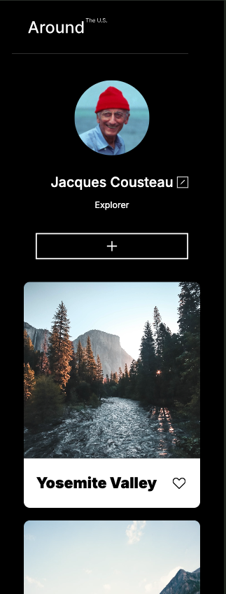
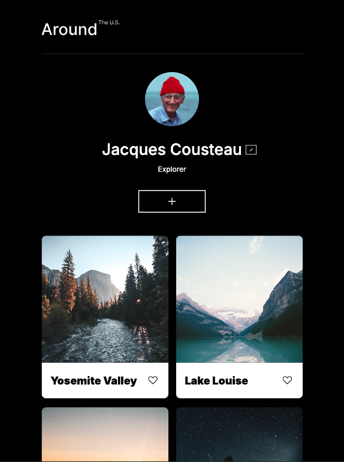
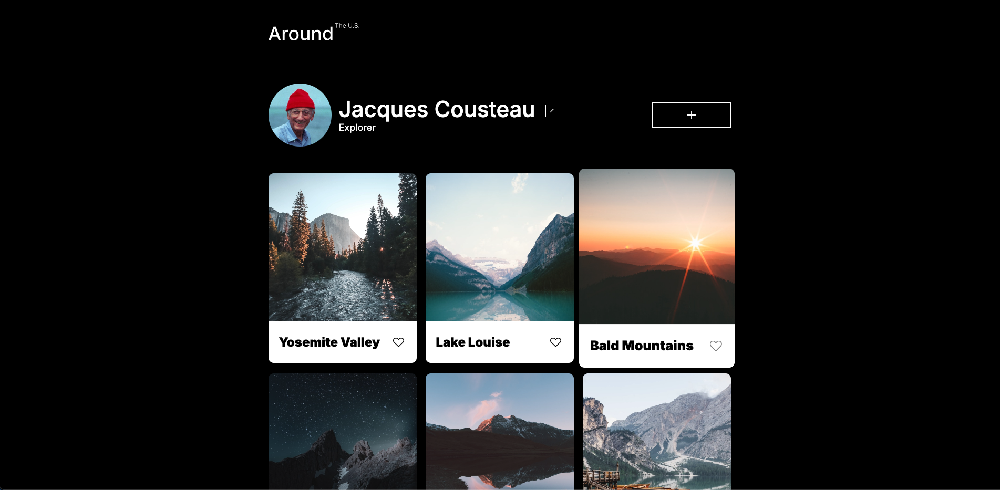

# Project 3: Around The U.S.

[Github Pages Link](https://jackmalzone.github.io/se_project_aroundtheus/)

# Overview

- Intro
- Features
- Figma
- Responsive Design
- JavaScript Features
- Technologies Used
- Setup
- Contributing
- Future Enhancements
- Author
- License
- Acknowledgements
- Contact

## Project Presentation Video

[Project Presentation Video](https://drive.google.com/file/d/128MIUpiH8dpSutuNqlz0rH96rTX0M1vG/view?usp=drive_link)

## Intro

"Around The U.S." is an interactive web platform that invites users to explore and share the breathtaking landscapes of America. It allows users to post photos, engage with images of scenic locations, like their favorites, and personalize their profiles.

## Features

- **Photo Sharing:** Users can post images of their travels across the United States.
- **Likes System:** Users can like photos posted by others, curating a collection of favorites.
- **Profile Customization:** Users can add a personal touch to their profiles by adjusting their information and avatar.
- **Loading Screen:** A custom loading screen with a logo and travel-related messages to enhance user experience.

**Figma**

- [Link to the project on Figma](https://www.figma.com/file/E5x6ib3osaUUNwLRRAsTDX/Sprint-9_-Applied-JavaScript-?t=3hvVWRz9LUFsxyNn-6)

## Responsive Design

`This project is fully responsive, designed to provide an optimal viewing experience across a wide range of devices. By utilizing media queries, flexible grid layouts, and adaptive units such as percentages and viewport units, the layout adapts to screen sizes as small as mobile phones to as large as desktop monitors.`

Key responsiveness features include:

- **Media Queries:** CSS media queries are used to apply different styling rules based on the viewport size.
- **Flexible Images and Grids:** All images and grid-based layouts scale and resize to maintain their aspect ratio and fit within their respective containers.
- **Adaptive Units:** The use of `rem`, `vw`, and `vh` units, along with percentage-based widths, ensures that padding, margins, and element sizes adjust to the screen.
- **Real-time Interaction**: Implement interactive features such as liking a photo and deleting a card, showing immediate feedback in the user interface without page reloads.

## JavaScript Features

In "Around The U.S.", I leverage the power of JavaScript ES6 to create an immersive and interactive experience. Here are some of the core JavaScript features used:

- **Dynamic Content Creation**: Using `document.createElement()` and template literals, build and insert content into the DOM, populating the page with user-generated cards.

- **Modular Functionality**: Organized the code into reusable functions for tasks like opening and closing modals, rendering cards, and handling form submissions.

- **Event Handling**: Added event listeners to buttons and other elements to handle clicks, form submissions, and other user interactions, such as liking and deleting photos, and ensuring a responsive and intuitive experience.

- **DOM Manipulation**: Dynamically update the DOM in response to user actions, like updating profile information, liking photos, and removing cards from the view.

- **Template Cloning**: Utilize `document.importNode()` to clone template elements which allows for efficient mass-production of DOM elements from a single source.

- **Modal Management**: Control the opening and closing of modals, providing an engaging user interface without navigating away from the main page.

The JavaScript codebase is designed to be scalable and maintainable, with a clear structure that separates concerns and allows for future enhancements.

## Technologies Used

- HTML5 for structured web content
- CSS3 for modern web styling
- JavaScript (ES6, DOM manipulation, event handling, and form validation)
- Webpack for module bundling
- Git and GitHub for version control
- Figma for design mockups

## Webpack Setup

The project uses Webpack for bundling JavaScript modules, enabling a cleaner and more efficient development process. The Webpack configuration includes:

- **Entry and Output**: Specified entry point for the app and the output directory for the bundled code.
- **Loaders**: Configured loaders for processing CSS and images, allowing seamless integration and optimization.
- **Plugins**: Utilized plugins for HTML template generation and environment variable management.

## Git Setup

To view the project on your local machine:

1. Clone the public repository using `git clone`.
2. Open the `index.html` file in a modern web browser to see the project live.

## Contributing

Interested in contributing? We'd love your help improving "Around The U.S."! Check out the future enhancements and see if there's anything you'd like to work on.

## Future Enhancements

We are committed to continually enhancing the user experience and feature set of "Around The U.S." Planned future improvements include:

- **Interactive Map Integration:** Implement an interactive map that allows users to explore and upload photos geographically, making the exploration of landscapes more intuitive and visually engaging.
- **User Commenting System:** Develop a feature for users to comment on photos, fostering a community of discussion and shared experiences.
- **Advanced Search Functionality:** Introduce an advanced search to filter images by location, popularity, or date, making it easier for users to find the content they are interested in.
- **Personalized User Galleries:** Enable users to create and share personalized galleries, organizing photos based on themes or trips.
- **Mobile App Development:** Expand the platform's reach by developing a mobile application for iOS and Android to allow users to post and interact with content on-the-go.
- **Light Mode:** Provide a light mode option for improved accessibility in bright lighting.
- **Performance Optimization:** Continue to optimize the site's performance, particularly image loading times, for a smoother and faster user experience.
- **Accessibility Improvements:** Ensure the site is fully accessible by conducting thorough accessibility audits and addressing any issues to comply with WCAG guidelines.

We are open to feedback and suggestions from the community and welcome contributions that will help make "Around The U.S." even better. Stay tuned for updates and new features!

## Author

Jack Malzone

## License

MIT

## Acknowledgements

- Thanks to TripleTen for another great challenge, and most importantly, thank you to Jacques Cousteau for the inspiration behind this project.
- All images are credited to their respective photographers.

## Contact

For any additional questions or comments, please email [jackmalzone@gmail.com](mailto:jackmalzone@gmail.com).
